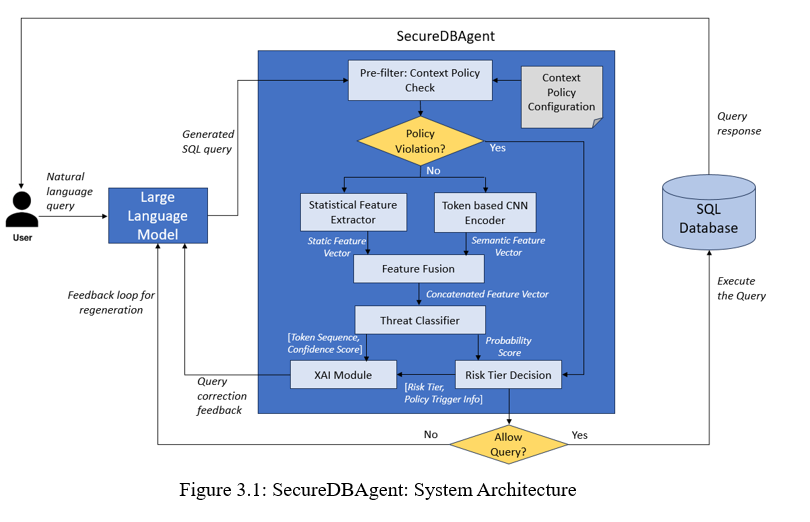
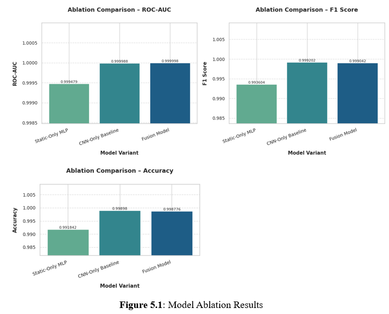
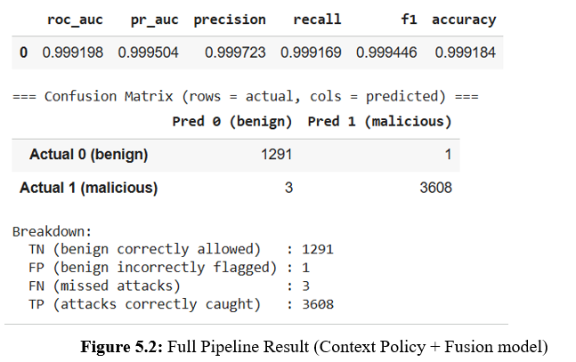
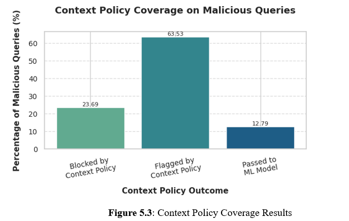
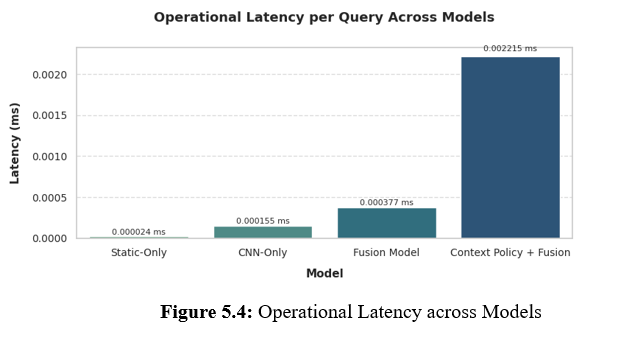
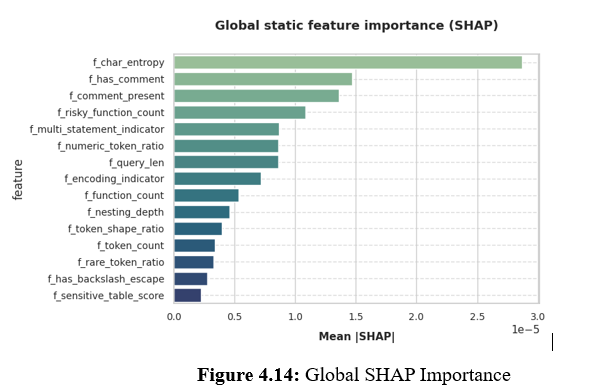
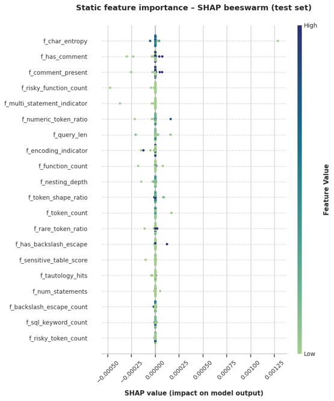
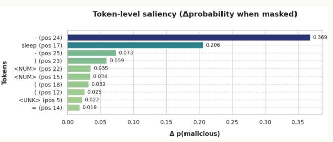

# SecureDBAgent: Shielding Databases from Agentic AI


> **A context-aware, explainable AI security framework for protecting enterprise databases from unsafe SQL queries generated by Agentic AI and LLM-driven systems.**

---

## Project Identity

**Project Title:** SecureDBAgent: Shielding Databases from Agentic AI  
**Program:** Master of Science in Machine Learning & Artificial Intelligence  
**University:** Liverpool John Moores University  
**Author:** Rajani Nagaraju  
**Research Area:** Agentic AI Security, Database Security, LLM-Governed SQL Access, Explainable AI  

---

## Executive Summary

Large Language Models are increasingly being used inside autonomous and semi-autonomous enterprise agents. These agents can interpret natural language instructions, plan actions, call tools, and generate SQL queries for database access.

This creates a new class of database security risk.

Traditional database security assumes that SQL is written either by developers, applications, or users operating within predefined workflows. Agentic AI changes this assumption because SQL can now be generated dynamically by probabilistic models that do not inherently understand:

- Enterprise role permissions
- Schema sensitivity
- Data governance rules
- Session behaviour
- Historical access patterns
- Operational intent
- Business-specific access boundaries

SecureDBAgent addresses this emerging problem by acting as a **pre-execution security mediation layer** between an LLM-generated SQL query and the enterprise database.

The framework combines:

- Deterministic context-aware policy enforcement
- Statistical SQL feature engineering
- CNN-based semantic SQL representation learning
- Feature fusion
- MLP-based threat classification
- Risk-tier decisioning
- Explainability through SHAP, token saliency, and policy traces

The result is a multi-layered, auditable, and deployment-oriented security framework for validating AI-generated SQL before it reaches the database.

---

## Thesis Documents

This repository includes the academic thesis artefacts associated with the MSc Machine Learning & Artificial Intelligence dissertation.

| Document | Description |
|----------|-------------|
| [Final Dissertation Report](docs/Rajani_N_Dissertation_Report.pdf) | Complete MSc thesis report submitted as part of the Liverpool John Moores University MSc Machine Learning & Artificial Intelligence program |
| [Thesis Presentation - PDF](docs/SecureDBAgent.pdf) | Presentation deck summarising the research problem, architecture, methodology, results, and conclusion |

These documents provide the academic and research context behind the SecureDBAgent implementation.

## Problem Statement

Agentic AI systems can generate syntactically valid SQL queries that are still unsafe.

The risk is no longer limited to classical SQL injection patterns such as:

- `OR 1=1`
- `UNION SELECT`
- Piggy-backed queries
- Time-based blind SQL injection
- Comment-based truncation

In LLM-driven database workflows, unsafe SQL can also arise from:

- Role violations
- Over-privileged data access
- Hallucinated tables or columns
- Access to sensitive schemas
- Abnormal session behaviour
- Provenance drift
- Contextually inappropriate queries
- Prompt-to-SQL manipulation
- Agentic tool misuse

Traditional SQL injection detectors focus primarily on malicious syntax. However, LLM-generated SQL may appear syntactically valid while still violating enterprise policy or security expectations.

The central research question addressed by this project is:

> **How can enterprises enforce safe, context-aware, and explainable SQL execution when queries are generated by Agentic AI systems rather than human users?**

---

## Why This Project Matters

The rapid adoption of LLM-powered agents introduces a new security boundary:

```text
User Prompt
    ↓
LLM / Agent
    ↓
Generated SQL
    ↓
Enterprise Database
```

In this pipeline, the LLM becomes an active participant in database access.

This introduces several risks:

| Risk Type | Description |
|----------|-------------|
| Prompt-to-SQL manipulation | Malicious prompts can influence the LLM to generate unsafe SQL |
| Hallucinated schema access | LLMs may generate queries referencing non-existent or unauthorized tables |
| Role misalignment | The generated SQL may exceed the user's permitted access scope |
| Sensitive data exposure | Queries may access confidential, financial, or personal data |
| Multi-stage agentic exploits | Agent memory, tool outputs, or reasoning traces may be manipulated |
| Lack of auditability | Security teams need clear explanations for block or flag decisions |

SecureDBAgent is designed to close this gap by validating every AI-generated SQL query before execution.

---

## Research Contribution

This thesis does not treat SQL security as a simple binary classification problem.

Instead, it reframes SQL query execution as a **governed decision-making process** involving:

```text
Who is asking?
What data is being accessed?
Is this operation allowed?
Is the query structurally suspicious?
Is the query semantically malicious?
Is the behaviour unusual for this user/session?
Can the decision be explained?
```

The major contributions are:

1. **Context Policy Engine**  
   A deterministic and configurable policy layer that evaluates role permissions, schema sensitivity, allowed operations, provenance novelty, and session anomalies.

2. **Hybrid Threat Detection Engine**  
   A machine learning pipeline that combines handcrafted statistical SQL features with CNN-learned semantic embeddings.

3. **Feature Fusion Architecture**  
   A structural-semantic fusion model that jointly reasons over how a query is written and what the query intends to do.

4. **Risk-Tier Decision Framework**  
   A practical decision layer that maps threat probability and policy outcomes into `ALLOW`, `FLAG`, or `BLOCK`.

5. **Explainability Module**  
   A multi-level explanation system using policy traces, SHAP feature attribution, and token-level saliency.

6. **Deployment-Aware Evaluation**  
   Evaluation across open SQL datasets, policy-aware labels, ablation studies, zero-day benign workloads, and operational latency measurement.

---

## System Architecture



SecureDBAgent follows a layered defence architecture.

```text
LLM / Agent Generated SQL Query
              │
              ▼
Query Ingestion and Normalisation
              │
              ▼
Context Policy Engine
              │
      ┌───────┴────────┐
      │                │
      ▼                ▼
Policy BLOCK      Policy FLAG / ALLOW
      │                │
      ▼                ▼
Final Action     Statistical Feature Extraction
                       │
                       ▼
              CNN Semantic Encoder
                       │
                       ▼
                 Feature Fusion
                       │
                       ▼
              MLP Threat Classifier
                       │
                       ▼
              Risk Tier Decision Layer
                       │
                       ▼
       Explainability and Audit Evidence
                       │
                       ▼
           Final Decision: ALLOW / FLAG / BLOCK
```

---

## End-to-End Query Processing Flow

SecureDBAgent processes every SQL query through the following stages.

### 1. Query Ingestion

The incoming SQL query is intercepted before database execution.

Input includes:

- SQL query text
- User role
- User identifier
- Timestamp
- Session context
- Query provenance metadata

---

### 2. Query Normalisation

The query is normalised while preserving attack-relevant signals.

Normalisation includes:

- Unicode normalisation
- Percent-decoding
- Escape sequence decoding
- Whitespace standardisation
- Removal of non-printable control characters
- SQL-aware tokenisation

The design intentionally avoids over-cleaning because suspicious artefacts such as comments, encodings, and symbols may carry security meaning.

---

### 3. Context Policy Evaluation

The Context Policy Engine evaluates the query against enterprise governance policies.

It checks:

- Whether the role is allowed to perform the operation
- Whether accessed tables are permitted for the role
- Whether sensitive data tags are restricted
- Whether the query contains disallowed multi-statement patterns
- Whether the schema usage is plausible
- Whether the user's access behaviour is unusual
- Whether the session shows abnormal activity

The output of this stage is:

```text
ALLOW
FLAG
BLOCK
```

This layer provides deterministic governance before probabilistic ML inference.

---

### 4. Statistical Feature Extraction

Queries that require further analysis are transformed into handcrafted SQL security features.

Feature groups include:

- Structural features
- Lexical features
- Keyword features
- Obfuscation indicators
- Entropy-based features
- Clause complexity features
- SQL injection markers
- Risky function indicators

Examples of extracted features:

| Feature | Security Relevance |
|---------|-------------------|
| Query length | Long appended payloads may indicate injection |
| Token count | High token count may indicate chained logic |
| Comment presence | Used for truncating legitimate SQL logic |
| Semicolon count | Indicates multi-statement or piggy-backed queries |
| Tautology hits | Captures `1=1` style authentication bypass |
| Risky function count | Detects functions such as `SLEEP`, `BENCHMARK`, `pg_sleep` |
| Character entropy | High entropy may indicate obfuscation |
| Keyword density | High SQL keyword concentration may suggest injected logic |

These features provide interpretable structural evidence for downstream classification and explainability.

---

### 5. CNN-Based Semantic SQL Encoding

In parallel with statistical feature extraction, the SQL query is tokenised and passed through a CNN-based semantic encoder.

The CNN encoder captures local token patterns such as:

- `UNION SELECT`
- `OR 1 = 1`
- `SLEEP ( n )`
- Comment truncation markers
- Nested malicious fragments
- Obfuscated SQL structures

The encoder architecture includes:

- SQL-aware tokenisation
- Fixed sequence length
- Token embedding layer
- Parallel 1D convolutional filters
- Global max pooling
- Dropout
- Dense projection layer

This produces a fixed-length semantic representation of the SQL query.

---

### 6. Feature Fusion

SecureDBAgent fuses two complementary feature spaces:

| Representation | Captures |
|----------------|----------|
| Statistical features | Structural and interpretable SQL risk signals |
| CNN embeddings | Semantic and token-level attack intent |

The fused vector allows the classifier to jointly reason over:

```text
How the query is constructed
+
What the query intends to do
```

This is important because LLM-generated SQL may be structurally normal but semantically unsafe, or structurally suspicious even when token meaning appears benign.

---

### 7. MLP Threat Classification

The fused feature vector is passed to a Multi-Layer Perceptron classifier.

The classifier outputs:

```text
p(malicious)
```

This probability represents the likelihood that the query is malicious based on combined structural and semantic evidence.

The MLP is intentionally lightweight to support real-time pre-execution security checks.

---

### 8. Risk-Tier Decisioning

Instead of using a simple binary prediction, SecureDBAgent maps threat probability into operational risk tiers.

| Probability Band | Risk Tier | Default Action |
|------------------|-----------|----------------|
| p < 0.40 | Low | Allow |
| 0.40 ≤ p < 0.70 | Medium | Flag |
| p ≥ 0.70 | High | Block |

Context policy decisions can override ML predictions.

For example:

- If Context Policy returns `BLOCK`, the final decision is `BLOCK`.
- If Context Policy returns `FLAG`, the query is escalated even if ML probability is low.
- Only contextually valid and low-risk queries are allowed.

This design reflects real enterprise security workflows where ambiguous cases are escalated rather than blindly accepted or rejected.

---

### 9. Explainability and Audit Evidence

For every flag or block decision, SecureDBAgent produces explanation evidence from three sources:

| Explanation Layer | Purpose |
|-------------------|---------|
| Policy trace | Identifies violated role, schema, sensitivity, or session rule |
| SHAP attribution | Explains which statistical features influenced the ML decision |
| Token saliency | Highlights suspicious SQL tokens influencing CNN prediction |

This creates a unified explanation such as:

```text
Decision: BLOCK
Reason:
- User role is not allowed to access financial tables
- Query contains UNION-based extraction pattern
- Comment marker contributed strongly to malicious score
- Token saliency highlights UNION and SELECT as high-risk triggers
```

This is essential for enterprise auditability, compliance, and analyst trust.

## Dataset Sources

SecureDBAgent was evaluated using multiple open SQL datasets to cover both malicious SQL behaviour and benign real-world SQL workloads.

| Dataset | Purpose | Usage in Project |
|--------|---------|------------------|
| **SQLiV5 Dataset** | SQL injection and adversarial SQL examples | Used for supervised threat detection training and evaluation |
| **Kaggle SQL Injection Dataset** | Benign and malicious SQL queries | Used as part of the main labelled corpus |
| **Spider Dataset** | Complex benign SQL queries across multiple schemas | Used as a benign stress-test to evaluate false-positive behaviour |

The datasets are not stored in this repository because they may be large and should be downloaded separately by the user.

Expected input files:

```text
data/
├── SQLiV5.json
├── Modified_SQL_Dataset.csv
├── train_spider.json
├── train_others.json
└── test.json
```

---

## Repository Structure

The project is organised to reflect the complete SecureDBAgent pipeline from raw dataset ingestion to final model evaluation and explainability.

```text
securedbagent-agentic-ai-database-security/
│
├── README.md
├── requirements.txt
├── .gitignore
│
├── notebooks/
│   └── SecureDBAgent.ipynb
│├── docs/
│   └── Rajani_N_Dissertation_Report.pdf
    └── SecureDBAgent.pdf
├── data/
│   ├── README.md
│   ├── SQLiV5.json
│   ├── Modified_SQL_Dataset.csv
│   ├── train_spider.json
│   ├── train_others.json
│   ├── test.json
│   ├── final_data.csv
│   │
│   ├── review/
│   │   ├── combined_input_raw_merged.csv
│   │   ├── unlabeled_records_for_review.csv
│   │   └── non_sql_queries.csv
│   │
│   └── TestTrainSplit/
│       ├── train.csv
│       ├── validation.csv
│       └── test.csv
│
├── ContextPolicy/
│   ├── policies_generated/
│   ├── table_catalog/
│   ├── logs/
│   ├── config/
│   └── flagged_queries/
│
├── static_features/
│
├── cnn_encoder/
│
├── threat_classifier/
│
├── risk_tier/
│
├── evaluation/
│   └── ablation/
│
├── xai/
│
└── reports/
    └── figures/
```

---

## Important Path Assumption

The notebook is expected to run from the `notebooks/` directory.

Therefore, paths inside the notebook use `../` to refer to the project root.

Example:

```python
INPUT_DATA_DIR = "../data"
SQLIV5_PATH = "../data/SQLiV5.json"
KAGGLE_PATH = "../data/Modified_SQL_Dataset.csv"
```

This makes the project portable across:

- Local machine
- Jupyter Notebook
- VS Code
- Google Colab with adjusted mount paths
- GitHub clone environments

---

## Data Pipeline

The data pipeline starts by reading multiple SQL datasets, validating their structure, cleaning noisy records, removing duplicates, and preparing a final labelled dataset for model training.

### Input Dataset Paths

```python
INPUT_DATA_DIR = "../data"

SQLIV5_PATH = "../data/SQLiV5.json"
KAGGLE_PATH = "../data/Modified_SQL_Dataset.csv"
SPIDER_DATA1_PATH = "../data/train_spider.json"
SPIDER_DATA2_PATH = "../data/train_others.json"
SPIDER_DATA3_PATH = "../data/test.json"
```

### Human Review Outputs

During cleaning, records requiring inspection are exported into a review directory.

```python
DATA_CLEAN_REVIEW_PATH = "../data/review"

OUT_COMBINED_CSV = "../data/review/combined_input_raw_merged.csv"
UNLABELED_CSV = "../data/review/unlabeled_records_for_review.csv"
NONSQL_CSV = "../data/review/non_sql_queries.csv"
```

These outputs support transparency in the preprocessing stage.

| File | Purpose |
|------|---------|
| `combined_input_raw_merged.csv` | Stores raw merged records before final cleaning |
| `unlabeled_records_for_review.csv` | Captures records where labels are missing or unclear |
| `non_sql_queries.csv` | Captures records filtered as non-SQL artefacts |

---

## Final Cleaned Dataset

After data cleaning and preprocessing, the final cleaned dataset is stored as:

```python
FINAL_DATA_CSV = "../data/final_data.csv"
```

This dataset is used for:

- Feature extraction
- Tokenisation
- CNN training
- Static feature modelling
- Fusion model training
- Threat classification
- Risk-tier evaluation

---

## Train / Validation / Test Split

The cleaned dataset is split into train, validation, and test sets.

```python
TEST_TRAIN_SPLIT_DATA_DIR = "../data/TestTrainSplit/"
```

The split strategy ensures that:

- Training data is used only for model learning
- Validation data is used for hyperparameter tuning and threshold selection
- Test data is preserved for final unbiased evaluation
- Spider data is used only as benign out-of-distribution evaluation

This separation is important because security models must be evaluated for true generalisation, not memorisation.

---

## Context Policy Engine

The Context Policy Engine is the first major decision layer in SecureDBAgent.

It is designed to answer questions that a normal SQL injection classifier cannot answer:

```text
Is this user allowed to perform this operation?
Is this table sensitive?
Is this access pattern normal for this user?
Is this query consistent with the user's historical behaviour?
Is this query plausible with respect to the known schema?
```

### Context Policy Output Directory

```python
CP_OUT_DIR = "../ContextPolicy"

POL_DIR = "../ContextPolicy/policies_generated"
CATALOG_DIR = "../ContextPolicy/table_catalog"
LOG_DIR = "../ContextPolicy/logs"
CONFIG_DIR = "../ContextPolicy/config"
HUMAN_REVIEW_DIR = "../ContextPolicy/flagged_queries"
```

### Context Policy Directory Purpose

| Directory | Purpose |
|----------|---------|
| `policies_generated/` | Stores generated role-specific policy files |
| `table_catalog/` | Stores table metadata, sensitivity tags, and schema catalogues |
| `logs/` | Stores policy decision logs and execution traces |
| `config/` | Stores configurable thresholds and detector settings |
| `flagged_queries/` | Stores queries requiring human review |

---

## Context Policy Engine Responsibilities

The Context Policy Engine performs two categories of checks.

### 1. Hard Deterministic Policy Checks

These are non-negotiable enterprise governance checks.

Examples:

- Role not allowed to perform operation
- Non-admin user attempting DDL
- User accessing restricted table tags
- Query attempting multi-statement execution
- Query accessing sensitive schema without permission
- Use of banned constructs or risky database functions

These checks are deterministic and explainable by construction.

If a hard policy violation is found, the query can be immediately blocked without invoking the ML classifier.

---

### 2. Contextual Behavioural Detectors

These detectors identify behaviour that may not be syntactically malicious but is contextually suspicious.

| Detector | Purpose |
|---------|---------|
| Plausibility Detector | Checks whether table, column, and join usage is plausible |
| Provenance Novelty Detector | Checks whether the user is accessing unfamiliar data categories |
| Session Anomaly Detector | Detects rate spikes and abnormal session behaviour |
| Schema Integrity Detector | Identifies suspicious joins or schema inconsistencies |

This is especially important for Agentic AI, where the LLM may generate SQL that is technically valid but operationally unsafe.

---

## Policy Actions

The Context Policy Engine emits one of three decisions:

| Policy Action | Meaning |
|--------------|---------|
| `ALLOW` | Query is contextually acceptable |
| `FLAG` | Query is suspicious and should be reviewed or escalated |
| `BLOCK` | Query violates a hard policy or high-risk rule |

This design prevents the system from relying entirely on machine learning probabilities for governance decisions.

---

## Static Feature Extraction

The static feature extraction module converts SQL queries into interpretable numerical features.

```python
STATIC_OUT_DIR = "../static_features"
```

Static features capture structural and lexical properties of SQL queries.

They are useful because many SQL attacks are visible through abnormal structure even before semantic modelling is applied.

Examples:

```text
Query length
Token count
Keyword density
Comment presence
Semicolon count
Tautology indicators
UNION keyword count
Risky SQL function count
Entropy score
Multi-statement indicator
Encoded token presence
Clause depth
Operator-to-operand ratio
```

These features are valuable for two reasons:

1. They improve threat detection.
2. They make the model explainable through SHAP attribution.

---

## CNN Semantic Encoder

The CNN encoder learns semantic representations from SQL token sequences.

```python
CNN_OUT_DIR = "../cnn_encoder"
```

The CNN encoder is designed to capture local SQL token patterns such as:

```text
UNION SELECT
OR 1 = 1
SLEEP ( 5 )
-- comment truncation
DROP TABLE
SELECT password FROM users
```

The semantic encoder helps detect attacks that may not be obvious from handcrafted features alone.

### CNN Design Summary

| Component | Purpose |
|----------|---------|
| SQL-aware tokenisation | Preserves SQL structure and security-sensitive tokens |
| Embedding layer | Converts tokens into dense vectors |
| Conv1D filters | Capture local token-level patterns |
| Global max pooling | Extracts strongest malicious indicators |
| Dropout | Controls overfitting |
| Dense projection | Produces fixed-size semantic embedding |

The final output of this stage is a learned semantic representation of the query.

---

## Feature Fusion

The fusion stage combines:

```text
Static SQL Feature Vector
+
CNN Semantic Embedding
```

This allows SecureDBAgent to jointly reason over:

| View | Captures |
|------|----------|
| Structural view | How the query is constructed |
| Semantic view | What the query is trying to do |

This is one of the most important design choices in the thesis.

A pure static model may miss semantically dangerous queries.

A pure deep learning model may miss explicit structural and policy-relevant signals.

Fusion provides a stronger and more defensible threat representation.

---

## Threat Classifier

The threat classifier processes the fused feature vector.

```python
TC_OUT_DIR = "../threat_classifier"
```

The classifier is implemented using a Multi-Layer Perceptron.

It outputs:

```text
p(malicious)
```

This probability is not used blindly.

It is passed into the risk-tier decision layer and interpreted alongside the Context Policy Engine output.

---

## Risk-Tier Decision Layer

The risk-tier module converts ML probability into actionable enterprise security decisions.

```python
RISK_OUT_DIR = "../risk_tier"
```

Risk tiering allows SecureDBAgent to move beyond binary classification.

| ML Probability | Risk Tier | Default Action |
|---------------|-----------|----------------|
| `p < 0.40` | Low | Allow |
| `0.40 ≤ p < 0.70` | Medium | Flag |
| `p ≥ 0.70` | High | Block |

The final decision is determined by both:

```text
Context Policy Action
+
ML Threat Probability
```

This is important because enterprise security cannot depend only on prediction confidence.

A query can have low ML malicious probability but still violate policy.

Example:

```text
A reporting user attempts to access payroll data.
The SQL may look syntactically benign.
But the access violates role and sensitivity policy.
Therefore, the query should be flagged or blocked.
```

---

## Evaluation

Evaluation artefacts are stored under:

```python
EVAL_OUT_DIR = "../evaluation"
ABL_OUT_DIR = "../evaluation/ablation"
```

The evaluation layer includes:

- Model-level performance
- Static-only model evaluation
- CNN-only model evaluation
- Fusion model evaluation
- Full pipeline evaluation
- Context policy coverage
- Risk-tier threshold validation
- Latency analysis
- False-positive analysis on benign workloads

The ablation study is important because it demonstrates the contribution of each model component independently.

---

## Explainable AI

The XAI module stores explainability outputs under:

```python
XAI_DIR = "../xai"
```

SecureDBAgent explains decisions using three complementary explanation mechanisms.

| Explanation Method | Explains |
|-------------------|----------|
| Policy trace | Why a policy rule was triggered |
| SHAP attribution | Which static features contributed to the ML decision |
| Token saliency | Which SQL tokens influenced the CNN prediction |

This allows the framework to produce explanations suitable for:

- Security analysts
- Database administrators
- Compliance reviewers
- Audit teams
- ML engineers
- Enterprise AI governance teams

---

## Why This Directory Design Matters

The project structure is intentionally modular.

Each major stage of the SecureDBAgent pipeline has a dedicated output directory:

```text
data/               → Raw, reviewed, cleaned, and split datasets
ContextPolicy/      → Policy rules, catalogues, logs, and flagged queries
static_features/    → Engineered structural SQL features
cnn_encoder/        → Tokenisation outputs and CNN model artefacts
threat_classifier/  → Fusion model and classifier artefacts
risk_tier/          → Thresholds and risk-tier decisions
evaluation/         → Metrics, ablation results, and performance outputs
xai/                → Explainability outputs
reports/figures/    → Visual artefacts used in documentation
```

This design is aligned with enterprise-grade AI engineering because it supports:

- Reproducibility
- Modular debugging
- Independent component validation
- Auditability
- Clear separation of responsibilities
- Future productionisation

---

## Implementation Philosophy

SecureDBAgent is not designed as a single monolithic model.

It is designed as a security pipeline.

The core implementation philosophy is:

```text
Use deterministic rules where governance must be strict.
Use machine learning where threat patterns are uncertain.
Use explainability where trust and auditability are required.
Use risk tiers where operational decisions need nuance.
```

This makes the framework suitable for Agentic AI environments where database access must be safe, interpretable, and accountable.

---

## Experimental Design

SecureDBAgent was evaluated as both:

1. A machine learning threat detection model
2. A complete context-aware security mediation pipeline

This separation is important because the thesis does not evaluate only whether a SQL query is malicious. It evaluates whether a query is safe, policy-compliant, explainable, and operationally acceptable in an Agentic AI database access workflow.

The evaluation was performed at the following levels:

| Evaluation Level | Purpose |
|------------------|---------|
| Static-only model | Measures effectiveness of handcrafted SQL security features |
| CNN-only model | Measures effectiveness of semantic token-level SQL representations |
| Fusion model | Measures combined structural and semantic threat detection |
| Context Policy + Fusion pipeline | Measures full enterprise-ready security mediation |
| Spider benign workload testing | Measures false-positive behaviour on unseen legitimate SQL |
| Latency evaluation | Measures operational feasibility |
| Explainability evaluation | Validates decision transparency |

---

## Model Ablation Study

The ablation study compares the contribution of different learned representations.



| Model | ROC-AUC | F1 Score | Accuracy |
|------|---------|----------|----------|
| Static-Only MLP | 0.999479 | 0.993604 | 0.991842 |
| CNN-Only Baseline | 0.999988 | 0.999202 | 0.998980 |
| Fusion Model | 0.999998 | 0.999042 | 0.998776 |

### Interpretation

The static-only model performs strongly because SQL injection attacks often leave structural traces such as comments, tautologies, semicolons, risky functions, and abnormal entropy.

The CNN-only model performs better because token-level semantic patterns such as `UNION SELECT`, `OR 1=1`, and `SLEEP()` are effectively captured by convolutional filters.

The fusion model achieves the strongest ROC-AUC because it combines two complementary views:

```text
Structural anomaly signals
+
Semantic attack intent signals
```

Although the numerical differences between CNN-only and Fusion are small, the fusion architecture is more defensible for security use cases because it reduces representational blind spots.

In enterprise security, model selection is not based only on highest accuracy. It must also consider:

- Robustness
- Interpretability
- Generalisation
- Operational risk
- Explainability
- Resistance to adversarial variation

For these reasons, the Fusion model is selected as the preferred threat detection architecture.

---

## Full Pipeline Performance

The complete SecureDBAgent pipeline combines:

```text
Context Policy Engine
+
Fusion Threat Classifier
+
Risk-Tier Decision Layer
+
Explainability Module
```



### Full Pipeline Metrics

| Metric | Value |
|--------|-------|
| ROC-AUC | 0.999198 |
| PR-AUC | 0.999504 |
| Precision | 0.999723 |
| Recall | 0.999169 |
| F1 Score | 0.999446 |
| Accuracy | 0.999184 |

### Confusion Matrix

| Outcome | Count |
|---------|-------|
| True Negative | 1291 |
| False Positive | 1 |
| False Negative | 3 |
| True Positive | 3608 |

### Interpretation

The full pipeline achieves very high detection performance while keeping both false positives and false negatives extremely low.

This is important because database security systems must balance two competing risks:

| Risk | Impact |
|------|--------|
| False positive | Legitimate query is blocked, causing operational friction |
| False negative | Unsafe query is allowed, causing potential data exposure |

SecureDBAgent demonstrates that it can maintain strong protection without creating excessive disruption.

More importantly, this performance is not achieved by a single model alone. It is achieved through layered decision-making where deterministic policy enforcement and probabilistic ML detection work together.

---

## Context Policy Coverage

One of the central contributions of this thesis is the Context Policy Engine.

The policy engine evaluates SQL queries before ML inference and determines whether they should be allowed, flagged, or blocked based on enterprise governance rules.



### Context Policy Coverage on Malicious Queries

| Context Policy Outcome | Percentage |
|------------------------|------------|
| Blocked by Context Policy | 23.98% |
| Flagged by Context Policy | 63.28% |
| Passed to ML Model | 12.74% |

### Interpretation

The Context Policy Engine blocked or flagged **87.26% of malicious queries before ML inference**.

This is one of the most important findings of the project.

It shows that many unsafe SQL queries can be detected through governance and context before deep learning is even required.

This matters because Agentic AI database threats are not always visible as classical SQL injection syntax.

Many risks are contextual:

- The wrong role accessing sensitive data
- A user querying unfamiliar data domains
- An LLM hallucinating table access
- An agent producing unusual query patterns
- A session showing abnormal behaviour
- A query violating schema sensitivity rules

A pure ML classifier cannot fully understand these organisational constraints.

The Context Policy Engine therefore acts as a first-line enterprise governance layer.

---

## Risk-Tier Decision Strategy

SecureDBAgent does not directly convert the model probability into a binary prediction.

Instead, it maps threat probability into operational risk tiers.

| Probability Band | Risk Tier | Default Action | Meaning |
|------------------|-----------|----------------|---------|
| `p < 0.40` | Low | Allow | Query appears benign and contextually acceptable |
| `0.40 ≤ p < 0.70` | Medium | Flag | Query is suspicious or ambiguous |
| `p ≥ 0.70` | High | Block | Query is high-confidence malicious or unsafe |

### Why Risk Tiers Are Needed

A binary allow/block system is too rigid for enterprise security.

Some queries may not be clearly malicious but still require review.

Examples:

```text
A query accesses a sensitive table but does not contain SQL injection syntax.
A query is structurally unusual but not confidently malicious.
A user accesses a table category they have never accessed before.
An LLM generates a valid SQL query that violates role policy.
```

In such cases, the correct action is not always immediate blocking. The query may need to be flagged for human review or additional verification.

This is why SecureDBAgent uses three operational actions:

```text
ALLOW
FLAG
BLOCK
```

This mirrors real-world security operations where ambiguous risk is escalated rather than ignored.

---

## Final Decision Logic

SecureDBAgent combines context policy outcome and ML threat probability.

```text
If Context Policy = BLOCK
    → Final Action = BLOCK

If Context Policy = FLAG
    → Minimum Final Action = FLAG
    → ML classifier may escalate to BLOCK

If Context Policy = ALLOW
    → ML risk tier decides ALLOW / FLAG / BLOCK
```

This ensures that deterministic governance rules always have authority over probabilistic model confidence.

### Example

```text
Query:
SELECT * FROM payroll;

User Role:
reporting_user

ML Probability:
Low

Context Policy:
BLOCK because reporting_user is not allowed to access payroll data.

Final Action:
BLOCK
```

This demonstrates why ML confidence alone is insufficient for Agentic AI database security.

---

## Operational Latency

SecureDBAgent was also evaluated for runtime feasibility.



| Model / Pipeline | Average Per-Query Latency |
|------------------|--------------------------|
| Static-only | 0.000024 ms |
| CNN-only | 0.000155 ms |
| Fusion model | 0.000377 ms |
| Context Policy + Fusion | 0.002215 ms |

### Interpretation

The full pipeline introduces higher latency than standalone models because it performs additional policy checks, behavioural evaluation, feature extraction, model inference, risk-tiering, and explanation generation.

However, the absolute latency remains very small in the experimental environment.

This supports the thesis claim that SecureDBAgent is suitable as a pre-execution database security layer where the security benefit outweighs the minimal added overhead.

---

## Explainable AI Results

Explainability is treated as a core requirement in SecureDBAgent.

The system explains security decisions using three complementary mechanisms.

```text
Policy Trace
+
SHAP Feature Attribution
+
Token-Level Saliency
```

---

## Policy Trace Explanation

The Context Policy Engine records exactly which rule or detector caused a query to be flagged or blocked.

Example policy reasons:

```text
op_not_allowed_for_role
unauthorized_read_for_tags
multi_statement_not_allowed
sensitive_table_access_blocked
schema_plausibility_low
session_anomaly_detected
provenance_novelty_high
```

This is useful for:

- Security audits
- Compliance reviews
- Human-in-the-loop decisioning
- Incident investigation
- Database administrator review

---

## SHAP-Based Static Feature Explanation

SHAP is used to explain which handcrafted SQL features contributed most to the threat classification.



Important SHAP features include:

| Feature | Meaning |
|---------|---------|
| `f_char_entropy` | High character randomness or obfuscation |
| `f_has_comment` | Presence of SQL comment markers |
| `f_comment_present` | Comment-based truncation risk |
| `f_risky_function_count` | Use of functions such as `SLEEP`, `BENCHMARK`, `pg_sleep` |
| `f_multi_statement_indicator` | Indicates stacked or piggy-backed SQL |

### Example SHAP Interpretation

```text
The query was classified as high risk because:
- Comment markers were present
- Risky SQL function count was high
- Multi-statement indicator was active
- Entropy score suggested obfuscation
```

This makes model behaviour understandable to security analysts.

---

## SHAP Beeswarm Analysis



The SHAP beeswarm plot shows how feature values influence predictions across the test dataset.

Key observations:

- High entropy values push predictions toward malicious classification.
- Comment-related features are strong indicators of risk.
- Risky SQL functions consistently increase threat probability.
- The model does not rely on only one feature.
- Feature contributions remain stable across samples.

This supports the robustness of the static feature engineering strategy.

---

## Token-Level Saliency

Token-level saliency explains which SQL tokens influenced the CNN encoder.



Examples of high-saliency tokens:

```text
UNION
SELECT
SLEEP
BENCHMARK
--
OR
1
=
```

This confirms that the CNN model is learning meaningful SQL attack patterns rather than relying only on superficial frequency signals.

### Example Token-Level Explanation

```text
The CNN encoder assigned high influence to:
- UNION
- SELECT
- SLEEP
- comment delimiter --

These tokens align with known SQL injection and time-delay attack patterns.
```

---

## Unified XAI Output

SecureDBAgent combines all explanation signals into a single audit-friendly output.

Example:

```text
Final Decision: BLOCK
Risk Tier: HIGH
Threat Probability: 0.989

Policy Reasons:
- User role is not allowed to access financial tables
- Query contains disallowed operation for current role

Top Static Feature Contributions:
- Risky function count
- Comment presence
- Multi-statement indicator

High-Influence Tokens:
- SLEEP
- UNION
- SELECT
- --
```

This makes the framework suitable for enterprise environments where every automated security decision must be explainable.

---

## Why Explainability Is Critical

In database security, a black-box decision is not enough.

Security teams must understand:

```text
Why was this query blocked?
Was it a policy violation or ML-detected threat?
Which table or tag caused the violation?
Which query tokens looked malicious?
Which static features influenced the model?
Should this be escalated to a human reviewer?
```

SecureDBAgent answers these questions through multi-level explanation.

This is a key differentiator from conventional SQL injection classifiers.

---

## Key Findings

The thesis produced several important findings.

### 1. Context-Aware Security Is Essential

Many unsafe SQL queries are not detected purely through malicious syntax.

Context matters.

A query may be syntactically valid but unsafe because of:

- Role mismatch
- Schema sensitivity
- Unusual provenance
- Session anomaly
- Access to restricted data tags

The Context Policy Engine directly addresses this issue.

---

### 2. Fusion Improves Robustness

Static features and CNN embeddings capture different aspects of SQL risk.

| Component | Strength |
|----------|----------|
| Static features | Interpretable structural risk indicators |
| CNN encoder | Semantic token-level attack patterns |
| Fusion model | Joint structural-semantic threat reasoning |

The fusion design improves architectural robustness and makes the system more defensible for security use cases.

---

### 3. Risk Tiering Is More Practical Than Binary Classification

Security operations need more than allow/block decisions.

The `FLAG` state is important because it enables:

- Human review
- Additional authentication
- Query rewriting
- Escalation workflows
- Audit logging

This makes SecureDBAgent more aligned with real enterprise workflows.

---

### 4. Explainability Enables Trust

SecureDBAgent provides explanations at three levels:

```text
Policy level
Feature level
Token level
```

This makes the system suitable for regulated or compliance-sensitive environments.

---

### 5. The Framework Is Deployment-Aware

The modular design, low latency, interpretable outputs, and policy-driven structure make SecureDBAgent suitable as a blueprint for production-grade AI-to-database security mediation.

---

## Research Novelty

SecureDBAgent is novel because it moves beyond traditional SQL injection detection.

Traditional systems usually ask:

```text
Is this SQL query malicious?
```

SecureDBAgent asks a broader and more enterprise-relevant question:

```text
Is this AI-generated SQL query safe, policy-compliant, contextually appropriate, semantically valid, and explainable before execution?
```

This shift is important in the Agentic AI era.

---

## Comparison with Traditional SQL Injection Detection

| Traditional SQLi Detector | SecureDBAgent |
|---------------------------|---------------|
| Focuses on malicious SQL syntax | Evaluates syntax, semantics, role, context, and policy |
| Usually binary classification | Uses ALLOW / FLAG / BLOCK decisioning |
| Often ignores user role | Enforces role-aware access policies |
| Often ignores schema sensitivity | Uses table tags and sensitivity metadata |
| Limited explainability | Provides policy traces, SHAP, and token saliency |
| ML model acts as primary detector | Policy-first, ML-second layered architecture |
| Designed for human-authored SQL | Designed for LLM / Agentic AI-generated SQL |

---

## Practical Value

SecureDBAgent can be adapted as:

| Use Case | Description |
|----------|-------------|
| LLM SQL Gatekeeper | Validate LLM-generated SQL before database execution |
| AI Database Firewall | Act as a pre-execution security layer |
| Agentic AI Governance Layer | Enforce role, schema, and session-aware controls |
| SQL Threat Detection Engine | Detect malicious SQL using hybrid ML |
| Compliance Audit Support | Provide explainable evidence for blocked or flagged queries |
| Human Review Assistant | Prioritise suspicious queries for security teams |

---

## Enterprise Relevance

This project is directly relevant to modern enterprise AI adoption.

As organisations introduce AI agents into analytics, reporting, workflow automation, and decision-support systems, database access becomes a critical risk boundary.

SecureDBAgent provides a blueprint for securing that boundary.

It is especially relevant for domains such as:

- Banking
- Insurance
- Healthcare
- Retail analytics
- Telecom
- Government systems
- Enterprise data platforms
- Business intelligence systems
- Customer data platforms
- Internal AI assistants

In these environments, unsafe SQL execution can result in:

- Data leakage
- Privilege escalation
- Compliance violations
- Business disruption
- Sensitive data exposure
- Loss of trust in AI systems

SecureDBAgent addresses these concerns through context-aware, explainable, and risk-tiered SQL mediation.

---

## Limitations

While SecureDBAgent demonstrates strong performance and practical architectural value, the current implementation has certain limitations.

| Limitation | Explanation |
|-----------|-------------|
| Open dataset evaluation | The system was evaluated using public SQL datasets rather than live enterprise database traffic |
| Simulated context metadata | User roles, sessions, and timestamps were synthetically generated to enable context-policy evaluation |
| Static policy configuration | Role policies and schema tags are administrator-defined and do not yet self-adapt |
| SQL-only scope | The framework focuses on SQL query security and does not cover NoSQL injection, XSS, file-based attacks, or API-level exploits |
| No LLM fine-tuning | The system validates generated SQL after generation; it does not fine-tune or modify the upstream LLM |
| Prompt context not deeply integrated | The current framework focuses on SQL-level mediation, not full reasoning-trace analysis from the LLM agent |

These limitations are intentional boundaries of the research scope and provide clear directions for future extension.

---

## Future Enhancements

SecureDBAgent can be extended in multiple directions to make it closer to a production-ready AI database security platform.

### 1. Adaptive Context Policies

Future versions can support self-learning policy thresholds based on historical behaviour.

Instead of relying only on static role-policy files, the policy engine can learn:

- Normal access patterns
- Role-specific behavioural baselines
- Data-domain usage trends
- Time-based access norms
- Session-level risk profiles

This would allow the system to evolve with enterprise usage patterns while still preserving administrator control.

---

### 2. Cross-Query and Session-Level Reasoning

The current system evaluates individual queries with session metadata.

Future work can extend this to multi-query attack detection.

Example:

```text
Query 1: Inspect table names
Query 2: Probe column names
Query 3: Access sensitive table
Query 4: Extract filtered customer records
```

Individually, each query may look acceptable.

Together, they may indicate reconnaissance or staged data exfiltration.

Graph-based session modelling or temporal anomaly detection can help detect such slow, multi-step attacks.

---

### 3. Integration with LLM Prompt Context

SecureDBAgent can be enhanced by linking SQL-level decisions back to:

- User prompt
- LLM reasoning trace
- Agent tool-call history
- Memory state
- Retrieved context
- Prompt injection indicators

This would help answer:

```text
Did the unsafe SQL originate from the user request?
Did it come from prompt injection?
Did the agent hallucinate the schema?
Did tool output manipulate the agent?
```

This would make the framework even more powerful for Agentic AI security.

---

### 4. Real-Time Database Proxy Integration

In a production environment, SecureDBAgent can be deployed as a real-time mediation layer in front of the database.

Possible deployment patterns:

| Deployment Pattern | Description |
|-------------------|-------------|
| SQL proxy | Intercepts SQL before database execution |
| LLM tool gateway | Validates SQL generated by an LLM tool before execution |
| Database firewall extension | Adds AI-aware policy and ML detection to traditional database firewalls |
| Audit pipeline | Monitors and explains risky SQL after execution |
| Human approval workflow | Sends flagged queries to security analysts or DBAs |

Potential integration points:

```text
LLM Agent
   ↓
SQL Tool
   ↓
SecureDBAgent
   ↓
Database Proxy
   ↓
Enterprise Database
```

---

### 5. Expanded Explainability for Non-Technical Stakeholders

The current XAI layer provides technical explanations through:

- Policy traces
- SHAP values
- Token saliency

Future versions can generate natural-language explanations for:

- Auditors
- Compliance teams
- Business data owners
- Security reviewers
- Governance committees

Example:

```text
This query was blocked because the user role is not authorised to access financial data.
The query also contains a UNION-based extraction pattern, which is commonly associated with data exfiltration attempts.
```

This would make the system more usable in real enterprise governance workflows.

---

### 6. Support for Multiple Database Engines

The current implementation focuses on SQL-level security logic.

Future work can extend database-specific support for:

- MySQL
- PostgreSQL
- SQL Server
- Oracle
- Snowflake
- BigQuery
- Redshift

Each database engine has different syntax, functions, roles, and permission models.

Adding dialect-aware parsing would improve production readiness.

---

### 7. Model Compression for Low-Latency Deployment

For production use, the CNN and MLP components can be optimised using:

- Quantisation
- Model pruning
- Knowledge distillation
- ONNX export
- TensorFlow Lite conversion
- Batch inference optimisation

This would allow deployment in latency-sensitive environments.

---

## Technology Stack

| Layer | Technologies Used |
|------|-------------------|
| Programming Language | Python |
| Data Processing | Pandas, NumPy |
| SQL Parsing | sqlparse, custom SQL normalisation |
| Machine Learning | Scikit-learn |
| Deep Learning | TensorFlow, Keras |
| Semantic Encoder | CNN with token embeddings |
| Threat Classifier | MLP |
| Explainability | SHAP, token saliency, policy traces |
| Visualisation | Matplotlib, Seaborn |
| Experiment Tracking | CSV outputs, logs, evaluation artefacts |
| Development Environment | Jupyter Notebook |
| Security Design | RBAC, policy-as-data, schema sensitivity, risk-tiering |

---

## How to Run the Project

### 1. Clone the Repository

```bash
git clone https://github.com/your-username/securedbagent-agentic-ai-database-security.git
cd securedbagent-agentic-ai-database-security
```

---

### 2. Create a Virtual Environment

```bash
python -m venv venv
```

Activate the environment.

For Windows:

```bash
venv\Scripts\activate
```

For macOS / Linux:

```bash
source venv/bin/activate
```

---

### 3. Install Dependencies

```bash
pip install -r requirements.txt
```

---

### 4. Place Dataset Files

Download the required datasets and place them inside the `data/` directory.

Expected structure:

```text
data/
├── SQLiV5.json
├── Modified_SQL_Dataset.csv
├── train_spider.json
├── train_others.json
└── test.json
```

The actual dataset files are not included in this repository.

Refer to:

```text
data/README.md
```

for dataset sourcing instructions.

---

### 5. Run the Notebook

Open the notebook:

```text
notebooks/SecureDBAgent.ipynb
```

Run the notebook sequentially.

The notebook will create intermediate outputs in the following directories:

```text
data/review/
data/TestTrainSplit/
ContextPolicy/
static_features/
cnn_encoder/
threat_classifier/
risk_tier/
evaluation/
xai/
```

---

## Generated Outputs

After successful execution, the project generates artefacts across multiple stages.

| Output Directory | Generated Artefacts |
|------------------|---------------------|
| `data/review/` | Merged raw records, unlabeled records, non-SQL queries |
| `data/TestTrainSplit/` | Train, validation, and test splits |
| `ContextPolicy/` | Role policies, catalogues, logs, flagged queries |
| `static_features/` | Engineered SQL feature matrices |
| `cnn_encoder/` | Tokenisation outputs, vocabulary, CNN artefacts |
| `threat_classifier/` | Fusion model outputs and prediction results |
| `risk_tier/` | Risk-tier decisions and threshold outputs |
| `evaluation/` | Model metrics, ablation results, confusion matrices |
| `xai/` | SHAP results, token saliency, explanation outputs |
| `reports/figures/` | Visual documentation artefacts |

---

## Recommended Figures for README

The following figures are recommended for inclusion in the GitHub repository.

| Figure File | Purpose |
|------------|---------|
| `system_architecture.png` | Shows the complete SecureDBAgent pipeline |
| `context_policy_engine.png` | Explains the internal policy engine design |
| `data_cleaning_summary.png` | Shows dataset cleaning and preprocessing flow |
| `structural_features_density.png` | Demonstrates feature-level separation between benign and malicious queries |
| `obfuscation_markers.png` | Shows distribution of comment, escape, and encoding indicators |
| `token_count_distribution.png` | Explains max sequence length choice |
| `cnn_hyperparameter_tuning.png` | Shows CNN configuration selection |
| `mlp_hyperparameter_tuning.png` | Shows classifier tuning |
| `model_ablation_results.png` | Compares static-only, CNN-only, and fusion models |
| `full_pipeline_results.png` | Shows final pipeline performance |
| `context_policy_coverage.png` | Shows malicious query handling by policy layer |
| `operational_latency.png` | Demonstrates deployability |
| `global_shap_importance.png` | Explains global static feature importance |
| `shap_beeswarm.png` | Shows feature impact distribution |
| `token_saliency.png` | Shows influential SQL tokens |

Recommended location:

```text
reports/figures/
```

Example usage in README:

```markdown

```

---

## Security and Repository Hygiene

This repository intentionally excludes sensitive or large generated files.

The following should not be committed:

```text
Raw datasets
Large intermediate CSV files
Trained model binaries
Generated logs
Temporary outputs
Local environment files
System-specific cache files
```

Recommended exclusions are handled through `.gitignore`.

This keeps the repository:

- Lightweight
- Professional
- Reproducible
- Safe for public sharing
- Suitable for recruiter and technical reviewer inspection

---

## What Makes This Thesis Project Stand Out

SecureDBAgent stands out because it addresses a modern and emerging problem at the intersection of:

```text
Agentic AI
+
Database Security
+
Machine Learning
+
Explainable AI
+
Enterprise Governance
```

Unlike standard academic ML projects, this work is not limited to building a classifier.

It proposes a complete security architecture with:

- Threat modelling
- Policy enforcement
- Behavioural context
- Deep learning
- Risk scoring
- Explainability
- Operational evaluation
- Deployment awareness

This makes the project strongly aligned with real-world AI security challenges faced by modern enterprises.

---

## Interview Positioning

This project can be positioned in interviews as follows:

```text
My MSc thesis focused on securing enterprise databases from unsafe SQL generated by Agentic AI systems. 
The problem is that LLM-generated SQL may be syntactically valid but still unsafe due to role violations, schema hallucinations, sensitive data access, or abnormal session behaviour.

To address this, I designed SecureDBAgent, a multi-layered security framework that combines deterministic context policy enforcement with a hybrid ML threat detector. 
The ML component fuses handcrafted statistical SQL features with semantic embeddings learned through a CNN encoder, followed by an MLP classifier and risk-tier decision logic.

The framework also includes explainability through policy traces, SHAP feature attribution, and token-level saliency, making every block or flag decision auditable.
This makes the system suitable as a pre-execution security gatekeeper for LLM-driven enterprise database access.
```

---

## Key Takeaway

The central idea of SecureDBAgent is:

```text
Securing AI-generated SQL requires more than detecting SQL injection.
It requires understanding context, enforcing policy, modelling semantic intent, and explaining every security decision.
```

This thesis demonstrates that secure AI-to-database interaction is best achieved through a hybrid architecture:

```text
Rules where governance must be deterministic.
Machine learning where threats are uncertain.
Explainability where trust is required.
Risk tiers where operational decisions need nuance.
```

---

## Author

**Rajani Nagaraju**  
Master of Science in Machine Learning & Artificial Intelligence  
Liverpool John Moores University  

Background:

- 14 years of IT experience
- Strong backend and enterprise systems experience
- Extensive IoT data processing background
- Java, SQL, MySQL, MongoDB, Redis, Jasper reporting
- Executive Post Graduate Program in ML & AI
- MSc thesis focused on Agentic AI database security

---

## Academic Context

This project was completed as part of the MSc Machine Learning & Artificial Intelligence thesis work at Liverpool John Moores University.

The thesis explores the emerging security challenge of autonomous LLM-driven SQL generation and proposes SecureDBAgent as a context-aware, explainable, and enterprise-aligned mitigation framework.

---

## Disclaimer

This repository is intended for academic, research, and portfolio demonstration purposes.

The implementation demonstrates the design and evaluation of a SecureDBAgent framework using public datasets and simulated contextual metadata.

Before production deployment, the framework should be extended with:

- Live enterprise database logs
- Real RBAC metadata
- Database-specific schema catalogues
- Security team-reviewed policies
- Production-grade monitoring
- Integration with database proxies or access gateways

---

## Final Conclusion

SecureDBAgent demonstrates that protecting databases in the Agentic AI era requires a shift from traditional SQL injection detection to context-aware, explainable, policy-governed SQL mediation.

The project validates that deterministic policy enforcement and machine learning are not competing approaches.

They are complementary.

Together, they create a stronger, more transparent, and more enterprise-ready defence layer for securing AI-generated database access.

---